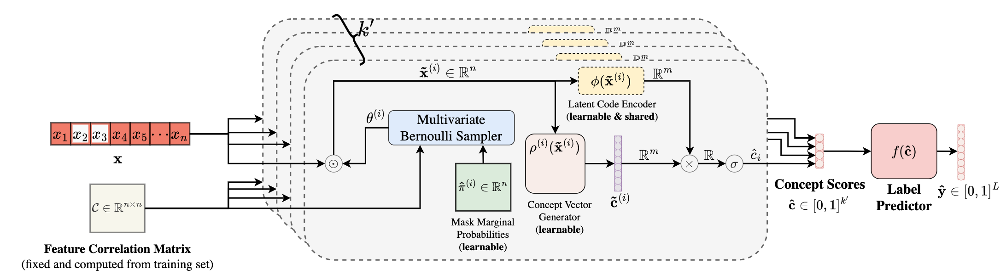

# TabCBM: Concept-based Interpretable Neural Networks for Tabular Data
[](https://github.com/mateoespinosa/tabcbm/blob/main/LICENSE) [](https://www.python.org/downloads/release/python-370/) [](https://openreview.net/forum?id=TIsrnWpjQ0) [](https://github.com/mateoespinosa/tabcbm/blob/main/media/poster.pdf)





This repository contains the official implementation of our **TMLR** paper
[*"TabCBM: Concept-based Interpretable Neural Networks for Tabular Data"*](https://openreview.net/forum?id=TIsrnWpjQ0) and its corresponding version in [**ICML's Workshop on Interpretable Machine Learning for Healthcare (IMLH 2023)**](https://openreview.net/forum?id=2YG1aTEaj4).

This work was done by [Mateo Espinosa Zarlenga](https://mateoespinosa.github.io/),
[Zohreh Shams](https://zohrehshams.com/),
[Michael Edward Nelson](https://uk.linkedin.com/in/michael-nelson-443029137),
[Been Kim](https://beenkim.github.io/),
[Mateja Jamnik](https://www.cl.cam.ac.uk/~mj201/)


#### TL;DR

There has been significant efforts in recent years on designing neural
architectures that can explain their predictions using high-level units
of information referred to as "concepts". Nevertheless, these methods have thus
far never been deployed or designed to be applicable for tabular tasks, leaving
crucial domains such as those in healthcare and genomics out of the scope of
concept-based interpretable models. In this work we first provide the a novel
definition of what a concept entails in a general tabular domain and then propose
**Tabular Concept Bottleneck Models (TabCBMs)**, a family of interpretable
self-explaining neural architectures capable of discovering high-level concept
explanations for tabular tasks **without sacrificing state-of-the-art performance**.

#### Abstract

Concept-based interpretability addresses the opacity of deep neural networks by
constructing an explanation for a model's prediction using high-level units of
information referred to as concepts. Research in this area, however, has been mainly
focused on image and graph-structured data, leaving high-stakes tasks whose data is
tabular out of reach of existing methods. In this paper, we address this gap by
introducing the first definition of what a high-level concept may entail in tabular
data. We use this definition to propose Tabular Concept Bottleneck Models (TabCBMs),
a family of interpretable self-explaining neural architectures capable of learning
high-level concept explanations for tabular tasks. As our method produces
concept-based explanations both when partial concept supervision or no concept
supervision is available at training time, it is adaptable to settings where concept
annotations are missing. We evaluate our method in both synthetic and real-world tabular
tasks and show that TabCBM outperforms or performs competitively compared to
state-of-the-art methods, while providing a high level of interpretability as measured by
its ability to discover known high-level concepts. Finally, we show that TabCBM can
discover important high-level concepts in synthetic datasets inspired by critical tabular
tasks (e.g., single-cell RNAseq) and allows for human-in-the-loop concept interventions
in which an expert can identify and correct mispredicted concepts to boost the model's
performance.


# Installation
We will soon refactor this library so that it can be directly installed as
a `pip` package. Until then, please read below for instructions on how to
recreate our experiments and for further information on our TabCBM main
model class.

Sorry in advance for all the inconveniences whilst the refactor is underway!

# Usage

## High-level Usage
In this repository, we include a standalone TensorFlow implementation of Tabular
Concept Bottleneck Models (TabCBMs) which can be easily trained from scratch
given a set of samples that may or may not have binary concept annotations.

In order to use our model's implementation, you first need to install all our
code's requirements (listed in `requirements.txt`) or by following the
installation instructions above.

After you have installed all dependencies, you should be able to import
`TabCBM` as a standalone keras Model as follows:

```python
from models.tabcbm import TabCBM

#####
# Define your pytorch dataset objects
#####

x_train = ...
y_train = ...
num_classes = ...

#####
# Construct the model's hyperparameters
#####
n_concepts = ...

tab_cbm_params = dict(
    features_to_concepts_model=..., # Provide Keras model to be used here
    features_to_embeddings_model=..., # Provide Keras model to be used here
    concepts_to_labels_model=..., # Provide Keras model to be used here
    mean_inputs=np.zeros(x_train.shape[1:], dtype=np.float32),
    loss_fn=..., # An appropiate loss function
    latent_dims=32, # Size of latent space for concept embeddings
    n_concepts=n_concepts,
    n_supervised_concepts=0, # Change to another number if concept supervision is expected (i.e., we have a c_train matrix)

    # Loss hypers
    coherence_reg_weight=..., # Scalar loss weight hyper
    diversity_reg_weight=..., # Scalar loss weight hyper
    feature_selection_reg_weight=..., # Scalar loss weight hyper
    prob_diversity_reg_weight=..., # Scalar loss weight hyper
    concept_prediction_weight=..., # Scalar loss weight hyper (only relevant if n_supervised_concepts != 0)
)

#####
# Perform its self-supervised pre-training first
#####

ss_tabcbm = TabCBM(
    self_supervised_mode=True,
    **tab_cbm_params,
)
ss_tabcbm.compile(optimizer=tf.keras.optimizers.Adam(1e-3))
ss_tabcbm._compute_self_supervised_loss(x_test[:2, :])
ss_tabcbm.set_weights(ss_tabcbm.get_weights())

ss_tabcbm.fit(
    x=x_train,
    y=y_train,
    validation_split=0.2,
    epochs=100,
    batch_size=256
)

#####
# And now do its supervised training stage
#####

tabcbm = TabCBM(
    self_supervised_mode=False,
    concept_generators=ss_tabcbm.concept_generators,
    prior_masks=ss_tabcbm.feature_probabilities,
    **tab_cbm_params,
)
tabcbm.compile(optimizer=optimizer_gen())
tabcbm._compute_supervised_loss(
    x_test[:2, :],
    y_test[:2],
    c_true=(
        c_train_real[:2, :]
        if c_train_real is not None else None
    ),
)
tabcbm.fit(
    x=x_train,
    y=y_train,
    validation_split=0.2,
    epochs=100,
    batch_size=256
)
```

Further documentation on this model's parameters, as well as test
scripts showing examples of usage, will be incoorporated with the aforementioned
refactor that is currently going on. Until then, feel free to raise an issue
or reach out if you want specific details on a parameter of TabCBM.

# Experiment Reproducibility

## Running Experiments

To reproduce the experiments discussed in our paper, please use our
`run_experiments.py` script after installing all dependencies
indicated above. You should then be able to run all experiments by running this
script with the appropiate config from the `configs/` directory.
For example, to run our experiments on the `Synth-Linear` dataset
(see our paper), you can execute the following command:

```bash
$ python run_experiments.py dot -c configs/linear_tab_synth_config.yaml -o results/synth_linear
```
This should generate a summary of all the results after execution has
terminated and dump all results/trained models/logs into the given
output directory (`results/synth_linear/` in this case).
